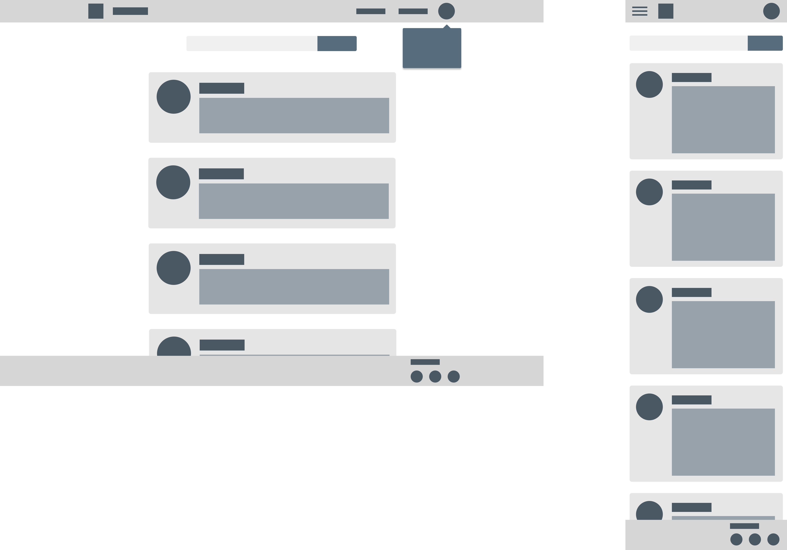
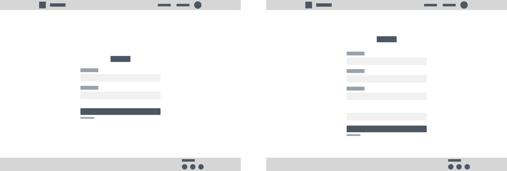
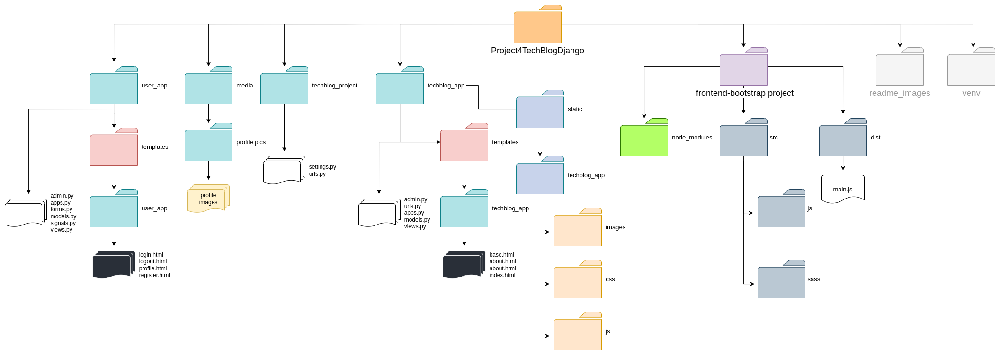
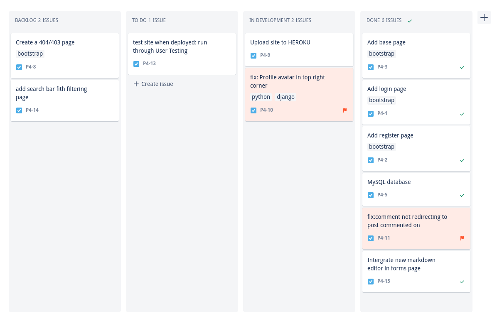
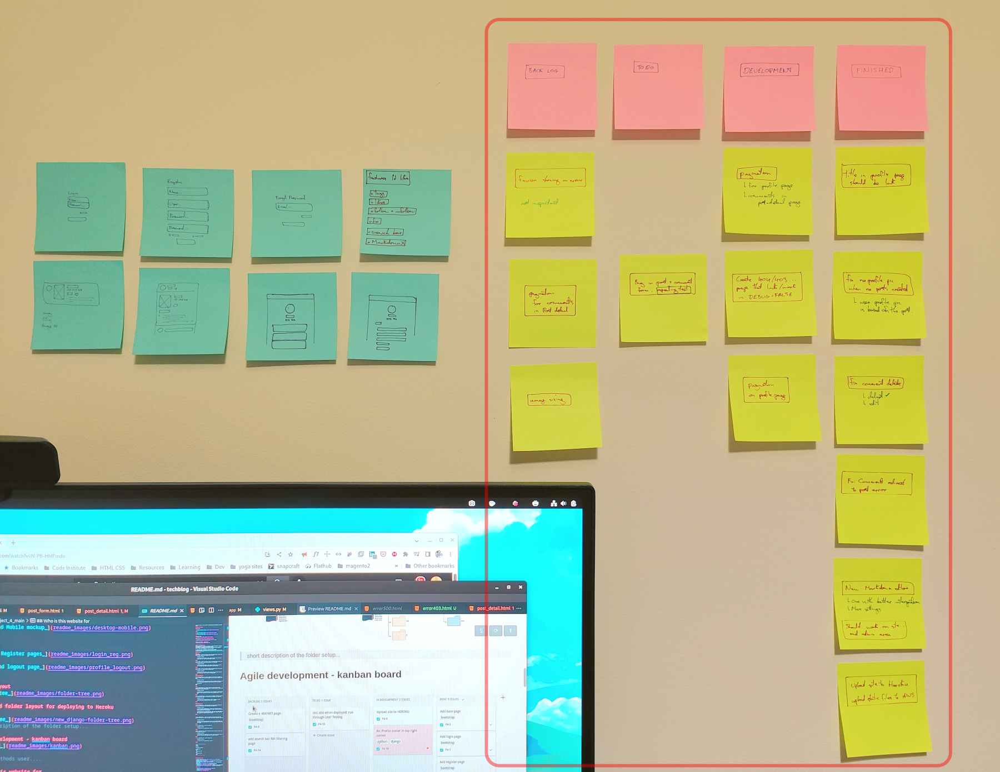
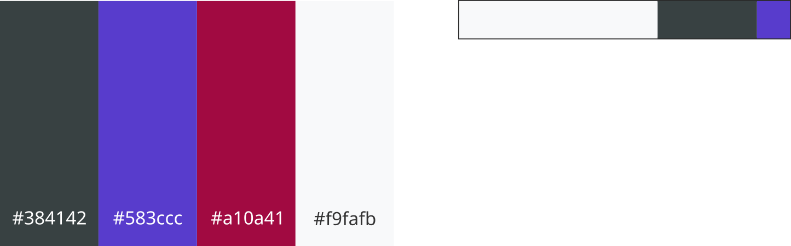

# project_4_main

top level folder for the project 4 containing bootstrap django and python files

## About the Project

## Wireframe

###### _Desktop and Mobile mockup_
&nbsp;

###### _Login and Register pages_

###### _Profile and logout page_

## Folder layout

> short description of the folder setup...

## Agile development - kanban board

kanban board in my office

 

###### Development - marked in red is the kanban board

> Issues, methods user....

## Who is this website for
This blog website is aimed at developers or people interested in coding & development, as it has a built in markdown editor.
The interface is designed to allow you to create short quick snippets of text or code with the emphases on text over images. 

* a group of people interested in discussion about coding
* a few admin users to help keep the site clean and free from online abuse through the admin panel.

## User Stories

#### Admin
* "As a admin, I want to be able to login to the admin panel so that I can view the user registered and logged in on the site."

	Acceptance criteria:

	1. Given that I'm the admin, when I login I'm able to go to the user section and see a list of users and who is online.
	
&nbsp;

* "As a admin, I want to be able to login to the admin panel so that I can see the users details and the users profile on the same page"

	Acceptance criteria:

	1. Given that I'm the admin, when I login I'm able to go to click on *User* and see their details and profile in the one section.
	
&nbsp;

* "As a admin, I want to be able to login to the admin panel from the main site so that it is  easy to access the admin area."

	Acceptance criteria:

	1. Given that I'm the admin, when I login to the site then I'm able to see the the *Admin Panel* link in the dropdown menu.
	
&nbsp;

#### Unregistered user

* "As a unregistered user, I want to be able to see posts and comments on the sit so that I don't have to be logged in just to see the content on the blog."

	Acceptance criteria:

	1. Given that I'm an unregistered user when I navigate to the site I can see the home page with posts and click on them to view the comments.

	2. Given that
when I 
Then

&nbsp;

* "As a unregistered user, I want to be able to see and test out the markdown editor used so that I don't have to create an account straight away to be able to see its functionality."

	Acceptance criteria:

	1. Given that I'm an unregistered user when I navigate to the About page and scroll down the page I can see and use the markdown editor in the page.

&nbsp;

* "As a unregistered user, I want be able to see people's profiles so that I as see their other comments if I find the users content to of interest."

	Acceptance criteria:

	1. Given that I'm an unregistered user when I navigate to a users profile from there I then can see their other comments.

&nbsp;

#### Registered user

* "As a registered user, I want to be able to log in with my username and password so that the site can authenticate and remember me."

	Acceptance criteria:

	1. Given that I'm a registered user, when I go to the login page and enter my username and password and click on Login, then the site logs me in and redirects me to the home page.

	2. Given that I'm not a registered user, when I go to the login page and enter an incorrect username and password and click on Login, then the site promotes me to enter the correct details.

&nbsp;

* "As a registered user, I want to be able to view my profile page that contains all my posts, so that I can keep track of what I posted on the site."

	Acceptance criteria:

	1. Given that I'm a registered user, when I go to my profile page I can then view all my previous posts as well as my profile details at the top of the page.

&nbsp;

* "As a registered user, I want to be able to "

	Acceptance criteria:

	1. Given that I'm a registered user, when I .

&nbsp;

* "As a registered user, I want to be able to edit my profile so that I can keep my details up to date"

	Acceptance criteria:

	1. Given that I'm a registered user, when I click "edit profile" then it takes me to an edit profile page whee I can edit my details.

&nbsp;

* "As a registered user, I want to be able to "

	Acceptance criteria:

	1. Given that I'm a registered user, when I .

&nbsp;

---------------------------
"As a
I want
so that ."

Acceptance criteria:

1. Given that
when I 
Then
	2. Given that
when I 
Then
	3. Given that
when I 
Then
---------------------------

## Technologies Used

* [Visual Studio Code](https://code.visualstudio.com/) IDE I used for Bootstrap, JavaScript, & Django
* [Webpack](https://webpack.js.org/) - for packing the scss file along with the bootstrap files to export to the main project
* [Amazon Web Services (AWS)](https://aws.amazon.com/) - for hosting the static files
* [Heroku](https://www.heroku.com/) for deploying the blog
* [GitHub](https://github.com/) - the version control
* [SQLite](https://www.sqlite.org/index.html) - database used in development
* [PostgreSQL](https://www.postgresql.org/) - database for production

### The Code

- [Bootstrap 5](https://getbootstrap.com/), HTML & CSS
- [JavaScript](https://www.javascript.com/)
- [Django](https://www.djangoproject.com/)
- [Python3](https://www.python.org/)

### Libraries &  utilities used 

* [crispy-bootstrap5 0.6](https://pypi.org/project/crispy-bootstrap5/) - form control & rendering 
* [bootstrap-icons]()
* [webpack 4.10](https://webpack.js.org/)
* [Pillow 9.2.0](https://pypi.org/project/Pillow/) - Python Imaging Library
* [EasyMDE - Markdown Editor](https://easy-markdown-editor.tk/) - a fork of SimpleMDE 
* [django-crispy-forms 1.14.0](https://django-crispy-forms.readthedocs.io/en/latest/) - for form handling
* [gunicorn 20.1.0](https://gunicorn.org/) - the Python WSGI HTTP Server

## Features

* Create account
* Change profile picture
* Change email address
* View posts and comments
* Create a post or comment on a post
* Edit or delete my post or my comment
* View a users profile and all their posts

## Files & classes ???

## Color Choices

Using the 60, 30, 10 Color Rule so not to overwhelm the user with too much color that would distract for the text in each post.

## Accessibility

* clean minimal design with use of white-space
* contrasting colors e.g. a lighter blue on the dark background of the code box in a post
* alternative text to images and buttons
* All elements the page are tab friendly 

## Testing
User testing, lighthouse from Chrome..... 

### Validator Testing

### Manual Testing
Creating multiple posts and comments bot editing them and deleting them to check the robust nature of the site.

## Error Handling

## Troubleshooting

profile pick was showing an error......

database broke during the creation of new tables while doing migrations, nothing fixed the error to resolve the issue. As I was only in the testing stage I deleted the database and reinitialized a new database. 

## Deployment

## Version Control
Github

### How To Clone The Project

## Resources

**General reading and resources.**

#### Bootstrap

* [Bootstrap Docs](https://getbootstrap.com/docs/5.2/getting-started/introduction/)

* [The Quick Python Book (online)](https://livebook.manning.com/book/the-quick-python-book-third-edition/chapter-23/1) - Chapter 23. Saving data, SQL databases
* [Bootstrap's Examples](https://getbootstrap.com/docs/5.0/examples/#snippets) - to help understand structure of elements on the page
* [Getting Started with Bootstrap 5](https://www.youtube.com/watch?v=1nxSE0R27Gg&t=101) - YouTube Tutorial
* [Create A Simple Blog With Python and Django](https://www.youtube.com/watch?v=B40bteAMM_M&list=PLCC34OHNcOtr025c1kHSPrnP18YPB-NFi) - YouTube Tutorial
* 
* 
* 

#### Django

* [Django documentation](https://docs.djangoproject.com/en/4.0/)

* [bootstrap-icons](https://icons.getbootstrap.com/)

#### Python

## Credits

**Sites content, media, and help with implementing code from tutorials & online help.**

#### Images & Icons

[pexels.com](https://www.pexels.com/search/cat/) - for the profile images

[Simple Icons](https://simpleicons.org/) - icons for the about page

#### Bootstrap

* [getbootstrap Docs](https://getbootstrap.com/docs/5.2/forms/overview/) - Form input

* [mdbootstrap](https://mdbootstrap.com/docs/standard/forms/input-fields/) - Form input

* [MDB Navbar component](https://mdbootstrap.com/docs/standard/navigation/navbar/?utm_source=pocket_mylist) - Bootstrap 5 Navbar component
* [Bootstrap Docs](https://getbootstrap.com/docs/5.0/components/alerts/?utm_source=pocket_mylist) - Alerts
* 
* 

#### Django & Python

* [Django docs - How to manage static files](https://docs.djangoproject.com/en/4.0/howto/static-files/)
* [Using the Django authentication system](https://docs.djangoproject.com/en/4.0/topics/auth/default/)
* [stack**overflow**](https://stackoverflow.com/questions/27171379/django-print-loop-value-only-once) - django print loop value only once (user for the avatar on profile page)
* [Django's Timezone](https://docs.djangoproject.com/en/4.1/ref/templates/builtins/#date) - for getting the exact time and date in the posts
* [Real Python - Users in Django Admin](https://realpython.com/manage-users-in-django-admin/?utm_source=pocket_mylist) - unregistering the provided model 'User', and registering my own model 'CustomUserAdmin'.
* [Importing a module based on installed python version](https://stackoverflow.com/questions/1875259/importing-a-module-based-on-installed-python-version)
* [Heroku Dev Center](https://devcenter.heroku.com/articles/django-assets) - Django and Static Assets
* [DreamHost Knowledge Base](https://help.dreamhost.com/hc/en-us/articles/115000695551-Installing-and-using-virtualenv-with-Python-3) -  Installing and using virtualenv with Python 3
* 
* 
* 

#### PostgreSQL *- database*
[How to Install and Configure Postgres 14 on Fedora 34](https://citizix.com/how-to-install-and-configure-postgres-14-on-fedora-34/)
* [Install pgAdmin 4](https://computingforgeeks.com/how-to-install-pgadmin-on-centos-fedora/) - database client

#### Other - 
* [SimpleMED Markdown Guide](https://simplemde.com/markdown-guide)