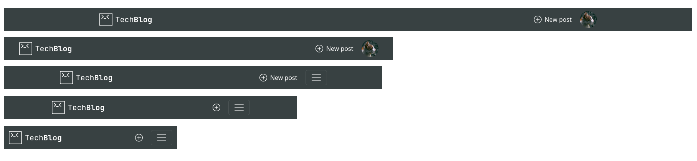
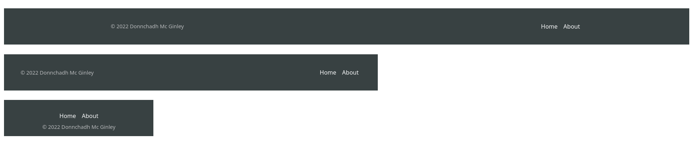
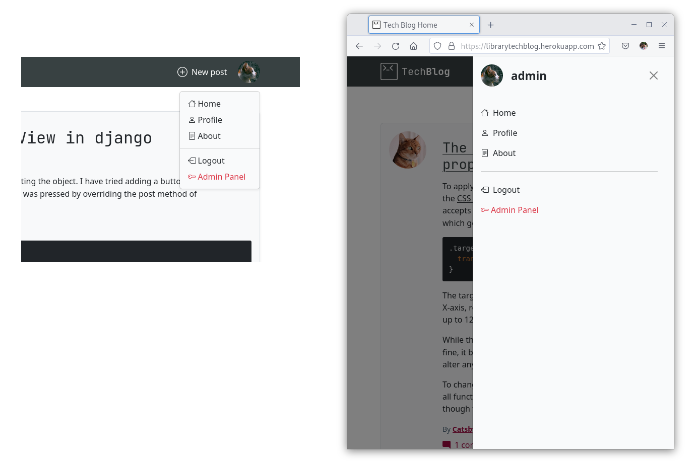
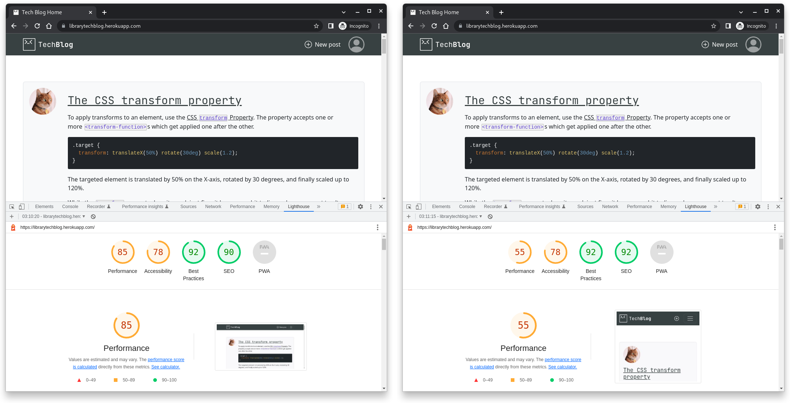
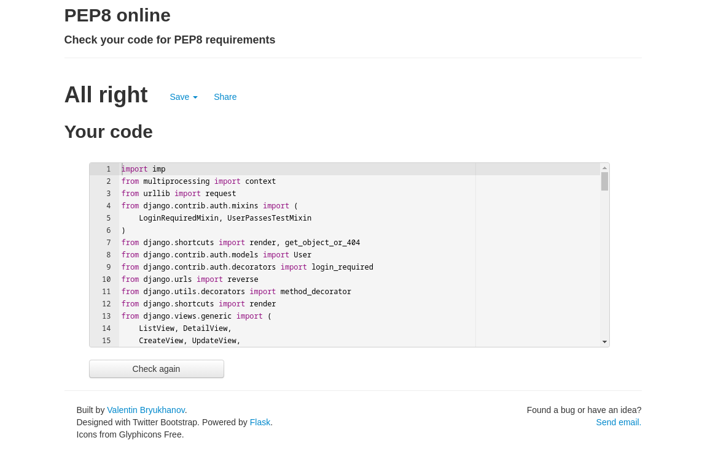
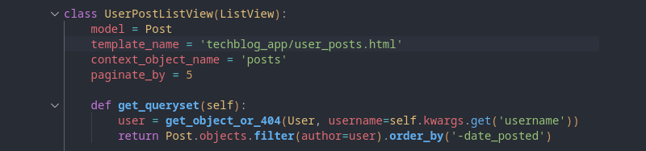

# project_4_main

top-level folder for project 4 containing bootstrap Django and python files

## About the Project

## Wireframe

###### _Desktop and Mobile mockup_
&nbsp;

###### _Login and Register pages_

###### _Profile and logout page_

## Project folder layout

I setup my environment with the main folder where I initialized the virtual environment  (venv),
with two projects inside:
 1. A Bootstrap project folder, with Bootstrap & Webpack installed in it 
 2. A Django project folder, with the blog app 
## Agile development - kanban board

Physical kanban board in my office

 

###### Development - marked in red is the kanban board

## Who is this website for
This blog website is aimed at developers or people interested in coding & development, as it has a built-in rich text editor with code blocks.
The interface is designed to allow you to create short quick snippets of text or code with an emphasis on text over images. 

The site would be best suited to a group of people interested in a discussion about coding/Webdev
	
* People who want a quick forum to chat or jot down coding ideas and concepts.
	
* A few admin users to help keep the site clean and free from online abuse through the admin panel, with the ability when necessary to edit or delete posts & comments.

* The blog fills the purpose of giving like-minded coders a place to congregate and discuss code projects, in an environment smiler in the style of a social media platform.
On the blog, you can upload rich text, code blocks, images, and links. 

## Epic

Create a blog app that can have multiple registered users who can post and leave comments on posts. They can view or edit their profile, and view other user profiles. A site that is half open so that it is not completely walled off to the public.

## User Stories

#### Admin
* "As an admin, I want to be able to login to the admin panel so that I can view the user registered and logged in on the site."

	Acceptance criteria:

	1. Given that I'm the admin when I log in I'm able to go to the user section and see a list of users and who is online.
"As an admin, I want to be able to login to the admin panel so that I can see the user's details and the user's profile on the same page"

	Acceptance criteria:

	1. Given that I'm the admin when I log in I'm able to go to click on *User* and see their details and profile in the one section.
	
&nbsp;

* "As an admin, I want to be able to log in to the admin panel from the main site so that it is  easy to access the admin area."

	Acceptance criteria:

	1. Given that I'm the admin when I log in to the site then I'm able to see the *Admin Panel* link in the drop-down menu.
	
&nbsp;

* "As an admin, I want the same rich text editor as on the blog so that I can create posts in the same way as the users, from the admin panel"

	Acceptance criteria:

	1. Given that I'm the admin when I log in to the admin panel to edit or create a post or comment, I can see the same editor there with all the same functionality.
 
	
&nbsp;

#### Unregistered user

* "As an unregistered user, I want to be able to see posts and comments on the site so that I don't have to be logged in just to see the content on the blog."

	Acceptance criteria:

	1. Given that I'm an unregistered user when I navigate to the site I can see the home page with posts and click on them to view the comments.

&nbsp;

* "As an unregistered user, I want to be able to see people's profiles so that I as see their other comments if I find the user's content to be of interest."

	Acceptance criteria:

	1. Given that I'm an unregistered user when I navigate to a user's profile from there I then can see their other comments.

&nbsp;

* "As an unregistered user, I want to be able to test out the text editor, so that I'll be able to see what a post or section of code would look like"

	Acceptance criteria:

	1. Given that I'm an unregistered user when I navigate to the about page at the bottom there is a rich text field where I can test out the editor.

&nbsp;

#### Registered user

* "As a registered user, I want to be able to log in with my username and password so that the site can authenticate and remember me."

	Acceptance criteria:

	1. Given that I'm a registered user, when I go to the login page and enter my username and password and click on Login, then the site logs me in and redirects me to the home page.

	2. Given that I'm not a registered user, when I go to the login page and enter an incorrect username and password and click on Login, then the site promotes me to enter the correct details.

&nbsp;

* "As a registered user, I want to be able to create a post so that I can tell people what I'm working on or tell them of something cool I've found."

	Acceptance criteria:

	1. Given that I'm a registered user, when I click **New post** (or the **+** symbol), then I'm redirected to the create post form where I can create the post.

&nbsp;

* "As a registered user, I want to be able to create a comment so that so that I can respond to people or discuss the topic posted"

	Acceptance criteria:

	1. Given that I'm a registered user when I click on **comments** on a post, I'm taken to the post with all the comments below, where I can click on the **reply** icon in the post, where by I'll be taken to the comment, from where I'll be able to write a comment.

&nbsp;

* "As a registered user, I want to be able to update a comment so that so that I can edit my response for spelling or other corrections"

	Acceptance criteria:

	1. Given that I'm a registered user when I click on the three dots in the top right-hand corner of my comment, a drop-down will appear with **Edit** or **Delete**.
	Then I can click on the **Edit** link where I'll be taken to the edit form.

&nbsp;

* "As a registered user, I want to be able to delete a post or comment so that I can remove it from the site."

	Acceptance criteria:

	1. Given that I'm a registered user when I click on the three dots in the top right-hand corner of my post or comment, a drop-down will appear with **Edit** or **Delete**.
	Then I can click on the **Delete** link where I'll be taken to the delete confirmation page, where I can hit **Confirm**.

	2. Given that I'm a registered user, when on the delete confirmation page if I chose to cancel deleting the post or comment, I get taken back to the previous page.

&nbsp;

* "As a registered user, I want to be able to view my profile page that contains all my posts, so that I can keep track of what I posted on the site."

	Acceptance criteria:

	1. Given that I'm a registered user, when I go to my profile page I can then view all my previous posts as well as my profile details at the top of the page.

&nbsp;

* "As a registered user, I want to be able to edit my profile so that I can keep my details up to date"

	Acceptance criteria:

	1. Given that I'm a registered user, when I click "edit profile" then it takes me to an edit profile page where I can edit my details.

&nbsp;

* "As a registered user, I want to be able to style my text and code so that I can make a colorful and easily understood, structured post."

	Acceptance criteria:

	1. Given that I'm a registered user when I create a post or comment I can clearly see the toolbar within the rich text editor.

&nbsp;

## Technologies Used

* [Visual Studio Code](https://code.visualstudio.com/) IDE I used for Bootstrap, JavaScript, & Django
* [Webpack](https://webpack.js.org/) - for packing the scss file along with the bootstrap files to export to the main project
* [Amazon Web Services (AWS)](https://aws.amazon.com/) - for hosting the static files
* [Heroku](https://www.heroku.com/) for deploying the blog
* [GitHub](https://github.com/) - the version control
* [SQLite](https://www.sqlite.org/index.html) - database used in development
* [PostgreSQL](https://www.postgresql.org/) - database for production

### The Code

- [Bootstrap 5](https://getbootstrap.com/), & HTML & CSS
- [JavaScript](https://www.javascript.com/)
- [Django](https://www.djangoproject.com/)
- [Python3](https://www.python.org/)

### Libraries &  utilities used 

* [Django-crispy-forms 1.14.0](https://django-crispy-forms.readthedocs.io/en/latest/) - for form handling
* [Crispy-bootstrap5 0.6](https://pypi.org/project/crispy-bootstrap5/) - form control & rendering 
* [Bootstrap-icons]()
* [Webpack 4.10](https://webpack.js.org/)
* [Pillow 9.2.0](https://pypi.org/project/Pillow/) - Python Imaging Library
* [Django-quill-editor](https://django-quill-editor.readthedocs.io/en/latest/) - the rich text editor
* [gunicorn 20.1.0](https://gunicorn.org/) - the Python WSGI HTTP Server

## Features 

1. Create an account & change profile picture & email.
2. View posts and comments.
3. Create posts or comment on posts.
4. Edit or delete my post or my comment.
5. I used Quill as the _rich text editor_.
6. The post (& the comment) shows the author, Time & Date posted, & the number of comments on the post.
View a user's profile and all their posts.
8. All posts & comments are in reverse order so the newest posts and comments are always seen first.
9. Pagination on the home page and the profile page - shoes 5 posts at a time for example purposes.

## Color Choices

Using the 60, 30, 10 Color Rule so as not to overwhelm the user with too much color that would distract from the text in each post.

## Site layout

## Accessibility

* Clean minimal design with the use of white space and small use of strong colors for text and links
* Contrasting colors e.g. a lighter blue on the dark background of the code box in a post,
I edited the < pre > text color so it would show up better on the dark terminal style background.
* alternative text on images, buttons, and < a > tags, where appropriate
* All elements on the page are tab friendly, mostly through the use of Bootstrap

## Testing

#### lighthouse from Chrome..... 

"Image elements do not have [alt] attributes" as they are the images in the posts so alt attributes can't be applied.

Performance is quite low on mobile (54%), some of it down to the part of Quill text editor and the images uploaded as I don't have an image resize function that deals easily with AWS.

I looked into AWS lambda functions for image resizing and for creating thumbnails but decided in the short time towards the end of the project that I had to reallocate my time to other more important parts of the project. 

## User tests
**Login**
	
* Go to the login page
* Enter your username & password
* Press the login button after which you will be redirected to the home page with your avatar showing in the top right-hand corner of the navbar

**Create an account**

* Go to the register page 
* Enter required details e.g. username password and press register
* You'll be redirected to the login page so that you'+ll be able to login to your new account

**Add a post**

* When logged in navigate to the add post button in the top right corner next to your avatar in the navbar
* Click it and you will be redirected to the add post page where you can create a post
* Once filled in press the post button and you'll be redirected to your post created (post_detail page).

**Create a comment**

* Navigate to the required post and click on the post (either the title of the post or the comment count icon)
* Then click reply at which point you'll be redirected to the Post A Comment page
* Fill in the comment (title and body), and click Post comment button
* You'll be redirected to your comment below the post (post_detail page).

**Change your profile picture**

* Go to your profile page
* Go to edit profile by pressing the Edit Profile button
* Go down to Image field and click Chose file, and upload a new image from your computer
* Select a file and then pressUpdate 
* You will be redirected back to the profile page again and an alert will show with "Account update successful"

### Validator Testing
* **lighthouse**
		Image elements do not have [alt] attributes as they are just the images in the posts so alt attributes can't be applied.

* All but one python file passed the [PEP8 online](http://pep8online.com/) - (line length set at 79 ch)
In _settings.py_ the first NAME of the AUTH_PASSWORD_VALIDATORS is 83 characters long, I kept it like that as splitting it was throwing up an error.

&nbsp;

### Manual Testing

* Created multiple accounts
* Created posts & comments to posts
* Checked pagination is working on the home (index.html) page and the profile (user_posts.html) page
* Deleted posts & comments, checked to redirect is working properly
* Edited/updated posts & comments
* Edited profile (picture, bio, & email)
* Checked post count is correct on the profile page.

* the only error I found is in the Quill rich text editor when entering a code block
inside < pre > tags. The syntax highlighting doesn't show in the finished post the first about 70% of the time, but if you edit the post or comment and add two spaces at the end (still inside the black box) and save then the syntax highlighting shows up again

## Error Handling

I created basic pages for handling the errors: 400, 403, 404, & 500 HTML error pages.
All errors should redirect to these pages when a specified location cant be got.

## Troubleshooting

* Profile pick was showing an error......
Database broke halfway through the project, during the creation of new tables while doing migrations, nothing fixed the error to resolve the issue. As I was only in the testing stage I deleted the database and reinitialized a new database. Which fixed the problem.

* Heroku kept showing H10 errors
	* The first time was due to the wrong Python version installed in my virtual environment, I uninstalled the older version and installed version 3.9.13, as in the [Heroku docs](https://devcenter.heroku.com/articles/python-support).
	* Later was with conflict of packages installed via the requirements.txt. I uninstall all unnecessary pip packages, which fixed the issue.

## Deployment

#### prerequisite for deployment

1. Install gunicorn

		$ pip install gunicorn

2.	I had [AWS](https://aws.amazon.com/) set up for this project to handle the static files.
		
		$ pip install boto3

3. Create the requirements.txt file (pip freeze > requirements.txt)
4. Create the Procfile, in the file, have <code>web: python manage.py migrate && gunicorn techblog_project.wsgi</code>

5. Do a final collectstatic of all static files

		$ python manage.py collectstatic for files

#### Deploying 

1. From VS Code within my work environment, where I have git initiated, login to heroku via the terminal.
		
		$ heroku login

	
	login with my username & password

1. Create an app on [Heroku](https://www.heroku.com/) site
2. Install a database in the app
3. Do a final
		
		$ git commit -m "your message"
		$ git push
4. Then push the project to Heroku

		$ git push heroku master

Once everything is compiled & ran correctly I checked everything was working okay. 

My Blog Project can be found here - https://...................... (same link as above).

## Version Control
The version control is done using Git through [GitHub](https://github.com/).

### How To Clone The Project

1. From the repository, https://github.com/dmcginley/Project4_django-bootstrap5 navigate to **Code** button, and in the dropdown menu select the URL: (https://github.com/dmcginley/Project4_django-bootstrap5.git).

2. Open a Terminal on your computer.

3. Type git clone, and then paste the URL you copied earlier.

4. Press Enter to create your local clone.

## Resources

**General reading and resources.**

#### Bootstrap

* [Bootstrap Docs](https://getbootstrap.com/docs/5.2/getting-started/introduction/)

* [The Quick Python Book (online)](https://livebook.manning.com/book/the-quick-python-book-third-edition/chapter-23/1) - Chapter 23. Saving data, SQL databases
* [Bootstrap's Examples](https://getbootstrap.com/docs/5.0/examples/#snippets) - to help understand the structure of elements on the page
* [Getting Started with Bootstrap 5](https://www.youtube.com/watch?v=1nxSE0R27Gg&t=101) - YouTube Tutorial
* [Create A Simple Blog With Python and Django](https://www.youtube.com/watch?v=B40bteAMM_M&list=PLCC34OHNcOtr025c1kHSPrnP18YPB-NFi) - YouTube Tutorial

#### Django

* [Django documentation](https://docs.djangoproject.com/en/4.0/)

* [bootstrap-icons](https://icons.getbootstrap.com/)

#### Python

## Credits

**Sites content, media, and help with implementing code from tutorials & online help.**

#### Images & Icons

* [pexels.com](https://www.pexels.com/search/cat/) - for the profile images

* [Simple Icons](https://simpleicons.org/) - icons for the about page

* [Stack**overflow**](https://stackoverflow.com/) - for the content of the majority of the posts
* [Web.dev Blog](https://web.dev/blog/) - for the more complicated and longer posts

#### Bootstrap

* [getbootstrap Docs](https://getbootstrap.com/docs/5.2/forms/overview/) - Form input

* [mdbootstrap](https://mdbootstrap.com/docs/standard/forms/input-fields/) - Form input

* [MDB Navbar component](https://mdbootstrap.com/docs/standard/navigation/navbar/?utm_source=pocket_mylist) - Bootstrap 5 Navbar component
* [Bootstrap Docs](https://getbootstrap.com/docs/5.0/components/alerts/?utm_source=pocket_mylist) - Alerts

#### Django & Python

* [Django docs - How to manage static files](https://docs.djangoproject.com/en/4.0/howto/static-files/)
* [Using the Django authentication system](https://docs.djangoproject.com/en/4.0/topics/auth/default/)
* [stack**overflow**](https://stackoverflow.com/questions/27171379/django-print-loop-value-only-once) - Django print loop value only once (user for the avatar on the profile page)
* [Django's Timezone](https://docs.djangoproject.com/en/4.1/ref/templates/builtins/#date) - for getting the exact time and date in the posts
* [Real Python - Users in Django Admin](https://realpython.com/manage-users-in-django-admin/?utm_source=pocket_mylist) - unregistered the provided model 'User', and registered my new model 'CustomUserAdmin'.
* [Importing a module based on installed python version](https://stackoverflow.com/questions/1875259/importing-a-module-based-on-installed-python-version)
* [Heroku Dev Center](https://devcenter.heroku.com/articles/django-assets) - Django and Static Assets
* [DreamHost Knowledge Base](https://help.dreamhost.com/hc/en-us/articles/115000695551-Installing-and-using-virtualenv-with-Python-3) -  Installing and using virtualenv with Python 3

#### PostgreSQL *- database*
* [How to Install and Configure Postgres 14 on Fedora 34](https://citizix.com/how-to-install-and-configure-postgres-14-on-fedora-34/)
* [Install pgAdmin 4](https://computingforgeeks.com/how-to-install-pgadmin-on-centos-fedora/) - database client I used for viewing the tables in the database
